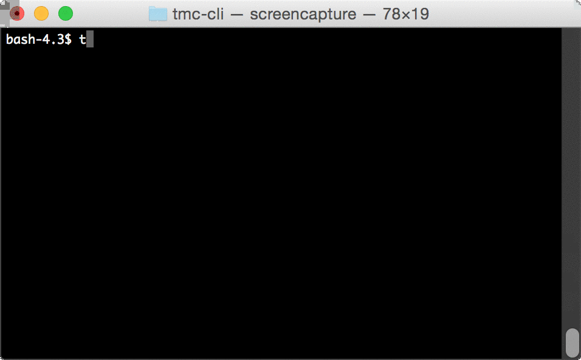
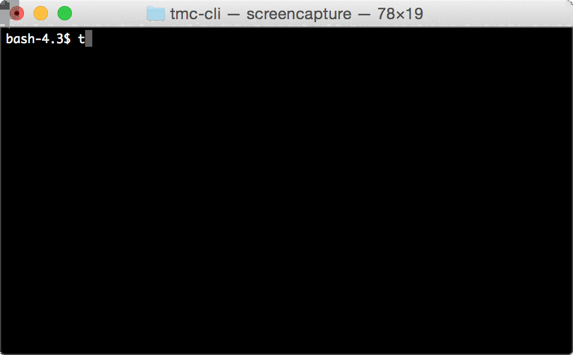
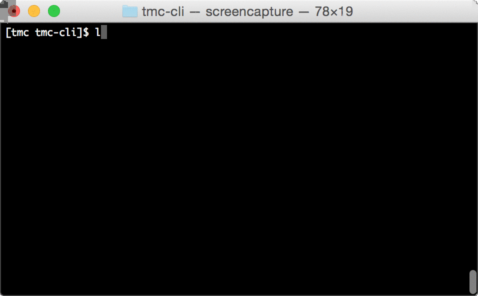
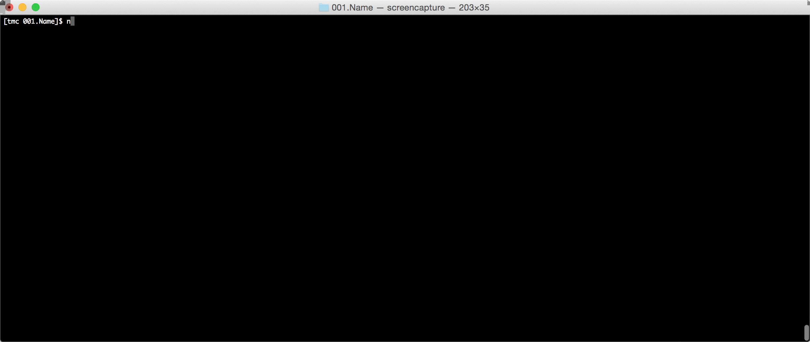

# tmc-cli

* Command-line client for [TestMyCode](https://github.com/testmycode/tmc-server)

Current core functionality includes:
* Downloading exercises from TMC-server
* Submitting exerises
* Running local tests
* Submittin pastes
* Getting notified by code reviews
* Listing available courses
* Setting server

[Installation instructions](Installation.md)

## Usage

1. Start logging in by using `tmc login` command. 

2. Downloading exercises requires course's id in TMC server. If you don't know the id of the course you want to download, you can list courses with `tmc listCourses` command. 

3. You can download a course to your current folder by typing `tmc download <course id>` 

4. You can now start doing exercises. If you want to see if tests pass, you can type `tmc test` in the exercise folder. 

5. You can submit the exercise by typing `tmc submit`. 

### List of commands:
- login
  - Takes a username and a password and remembers the information.
- test
  - Runs TMC tests on the exercise in the current directory
  - Returns info about the tests (failed/passed etc)
  - If no exercise is found, looks for it above
  - If it's still not found, throws an error
- submit
  - Submits an exercise in the current directory to the TMC server
  - If no exercise is found in the directory, looks for it in parent folder
  - If it's still not found, throws an error
- listCourses
  - Lists courses that exist on the specified TMC server and their course IDs
- download
  - Takes a course ID and downloads it to the current directory.
- help
  - Gives a list of commands
- ping
  - returns "pong" if the program is running
- setServer
  - Sets the server where to return exercises to and get exercises from
- listExercises
  - When a user is in a course directory, lists the exercises of that course
  - If the user has completed a certain exercise, it is shown that way

## Credits and maintainers
Tmc-cli was started by Ohjelmistotuotantoprojekti kesä 2015 (Software engineering project)
* Ilari Sinkkonen
* Kristian Wahlroos
* Samu Tamminen
* Pihla Toivanen
* Chang Rajani
* Jani Luukko

It was later improved by [RAGE -research group](https://www.cs.helsinki.fi/en/rage/).
